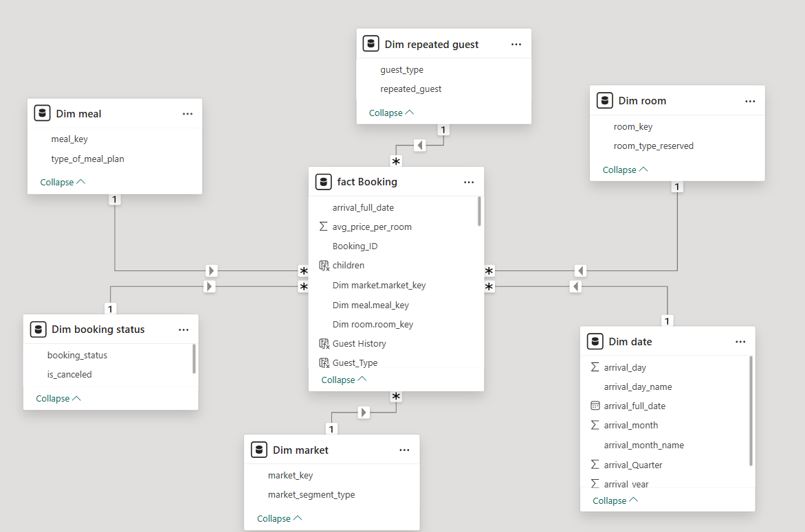
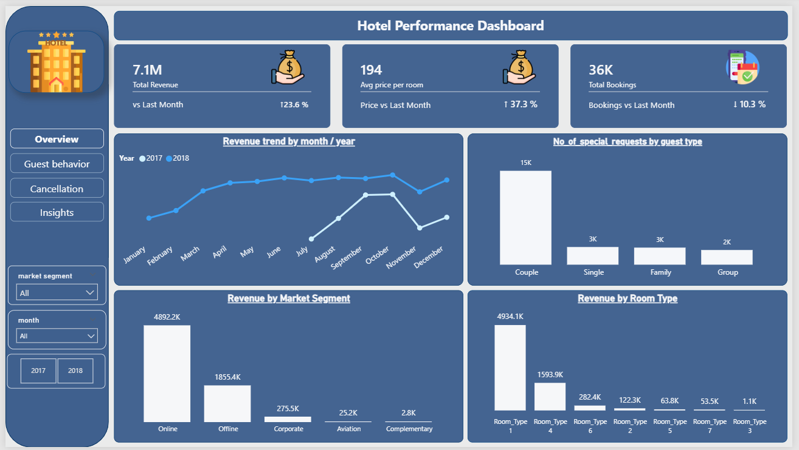
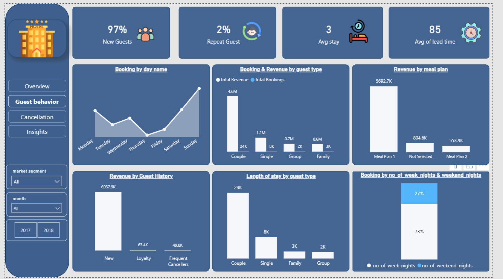
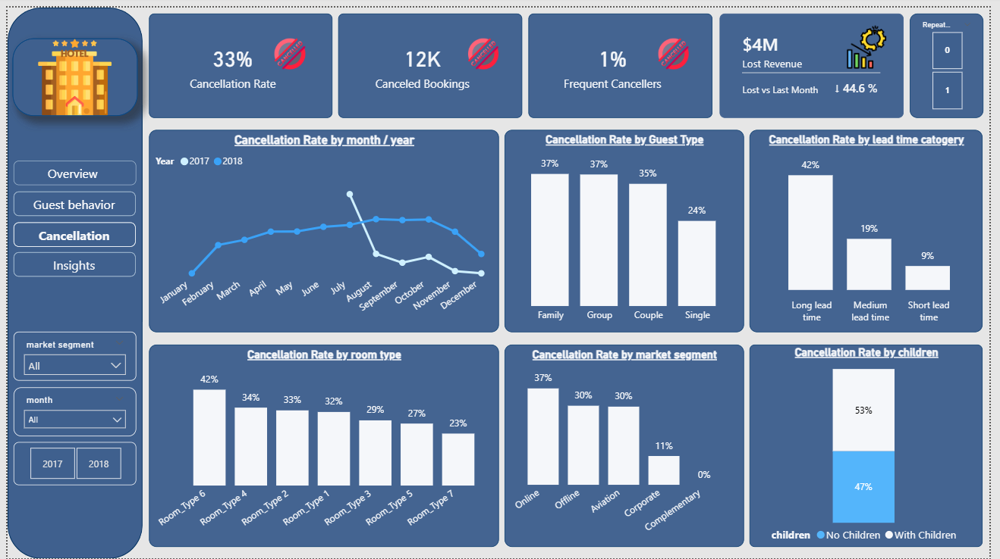
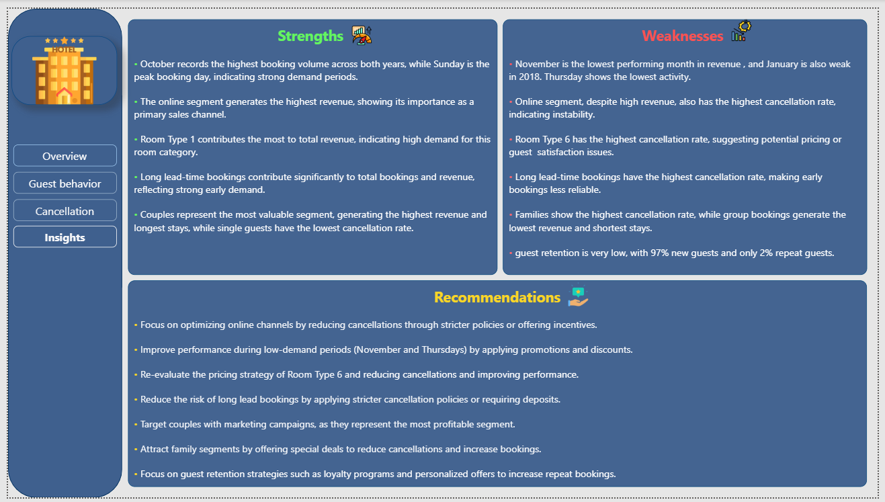

# Hotel Reservation Dashboard

## Project Overview
This project analyzes hotel booking data to uncover key business insights related to revenue, customer behavior, and cancellations.

The dashboard was built using Power BI to make data-driven decisions and improve hotel performance.

---

## Objectives
- Analyze total revenue and booking trends  
- Understand guest behavior patterns  
- Identify causes of high cancellations  
- Evaluate pricing and room performance  

---

## Tools Used
- Power BI  
- DAX (Data Analysis Expressions)  
- Data Cleaning & Transformation  
- Time-based analysis (Month-over-Month trends)

---

## Key KPIs

### 🔹 Core (Industry Standard) KPIs
- Cancellation Rate  
- Average Lead Time  
- Repeat Guest Rate  
- Average Length of Stay  

### 🔹 Custom / Analytical KPIs
- Total Revenue  
- Total Bookings  
- Average Price per Room  
- Lost Revenue  

---

## Dashboard Pages

### 1️⃣ Overview
- Revenue trend over time  
- Revenue by market segment  
- Revenue by room type  

---

### 2️⃣ Guest Behavior
- Booking patterns by day  
- Revenue & bookings by guest type  
- Length of stay analysis  

---

### 3️⃣ Cancellation Analysis
- Cancellation rate trends  
- Cancellation by guest type  
- Cancellation by lead time  

---

### 4️⃣ Insights & Recommendations

#### 🔹 Strengths
- October shows peak booking performance  
- Online segment generates highest revenue  
- Couples are the most profitable segment  

#### 🔹 Weaknesses
- High cancellation rate in online bookings  
- Room Type 6 has highest cancellations  
- Low repeat guest rate (customer retention issue)  

#### 🔹 Recommendations
- Improve cancellation policies for online bookings  
- Offer promotions during low-demand periods  
- Focus on customer retention strategies  
- Optimize pricing for high-cancellation rooms  

---

## Dashboard Preview

---

## Dataset
Hotel Reservation Dataset (public dataset used for analysis)
